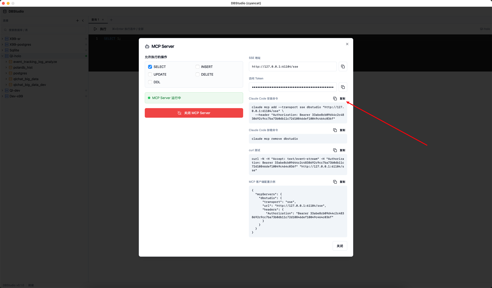

# DBStudio (cyancat)

<p align="center">
  <strong>轻量级跨平台数据库桌面客户端</strong><br>
  面向开发者、数据工程师和轻量级 DBA 的 Navicat 风格数据库管理工具
</p>

---

## ✨ 特性

- 🔌 **多数据源管理** — MySQL / MariaDB / PostgreSQL / SQLite / StarRocks，加密存储连接凭据
- 🌳 **对象树浏览器** — 数据库 → 表 → 字段 / 索引 / 外键，逐层懒加载
- 🎨 **可视化设计器** — 表设计器 + 字段网格，所有结构变更先预览 DDL 再执行
- 📝 **SQL 编辑器** — 基于 Monaco Editor，支持执行 / 格式化 / 注释切换
- 📊 **结果网格** — 虚拟滚动、列宽拖拽、分页、复制为 TSV / INSERT SQL / CSV
- ⚠️ **安全确认** — 高风险 DDL（DROP TABLE / DROP DATABASE）强制二次确认
- 🤖 **MCP Server** — 把数据源暴露给 AI Agent，支持细粒度操作授权与 WHERE 强制校验
- 🔒 **凭据加密** — AES-GCM 加密存储密码，支持 OS Keychain 扩展
- 🖥️ **跨平台** — macOS / Windows / Linux
- 🧮 **大整数精度保持** — 查询结果统一以字符串返回，避免前端 JS Number 精度丢失

## 📸 截图

### 数据源管理


### MCP Server



## 🚀 快速开始

### 前置条件

| 依赖 | 版本要求 |
|------|---------|
| Go | 1.25+ |
| Node.js | 任何现代 LTS |
| Wails CLI | v2 `go install github.com/wailsapp/wails/v2/cmd/wails@latest` |
| macOS | WebKit（系统内置） |
| Windows | WebView2（Windows 10+ 内置） |
| Linux | WebKit2GTK (`sudo apt install libwebkit2gtk-4.0-dev`) |

### 开发模式

```bash
# 克隆仓库
git clone https://github.com/cyan-daimao/cyancat.git
cd cyancat

# 启动开发模式（后端热重载 + 前端热更新）
wails dev
```

### 构建

```bash
# 当前平台
wails build

# 指定平台
wails build -platform darwin/universal    # macOS 通用二进制
wails build -platform windows/amd64       # Windows
wails build -platform linux/amd64         # Linux
```

产物输出到 `build/bin/`。源码仓库不再提交 `frontend/dist` 与 `build/dist`，构建产物由 `wails build` 本地生成。

### 常用命令

```bash
# 前端构建
cd frontend && npm run build

# Go 编译检查
go build ./...
go vet ./...
go test ./...

# 修改 Go API 签名后重新生成 Wails 前端绑定
wails generate module
```

> 注意：`wails generate module` 与 `wails build` 会生成 `frontend/wailsjs/`、`frontend/dist/` 和 `build/dist/` 等目录，这些已被 `.gitignore` 忽略，请勿手动提交。

## 🤖 MCP Server

DBStudio 支持把任意数据源暴露为 **MCP Server**，让其他 AI Agent（如 Claude、Kimi 等）安全地访问数据库。

### 开启方式

1. 在对象树中右键点击数据源 → **开启 MCP Server**。
2. 在配置对话框中选择允许执行的操作：
   - `SELECT` / `INSERT` / `UPDATE` / `DELETE` / `DDL`
3. 点击「开启」，对话框会展示：
   - SSE 接入地址，例如 `http://127.0.0.1:59492/sse`
   - 访问 Token
   - `curl` 测试命令
   - Claude Desktop 等客户端的安装/卸载命令


### 安全策略

- 关闭 DBStudio 时，所有 MCP Server 会随应用一起停止。
- `UPDATE` / `DELETE` 必须包含顶层 `WHERE` 子句，否则会被拒绝执行。
- 连接密码始终加密存储，Token 仅在内存中生成。

### 提供的工具

| 工具 | 说明 |
|------|------|
| `query` | 执行 `SELECT` / `WITH` / `SHOW` / `DESC` / `DESCRIBE` / `EXPLAIN`，自动 `LIMIT 1000` |
| `execute` | 执行 `INSERT` / `UPDATE` / `DELETE`，`UPDATE`/`DELETE` 强制要求 `WHERE` |
| `execute_ddl` | 执行 `CREATE` / `ALTER` / `DROP` / `TRUNCATE` / `RENAME` |
| `list_tables` | 列出表名，支持 `pattern`（表名）和 `comment`（表注释）过滤 |
| `describe_table` | 返回表结构（字段、索引、外键） |

## ⚙️ 运行时配置

| 配置项 | 说明 |
|--------|------|
| `CYANCAT_MASTER_KEY` | 64 位十六进制（32 字节）AES 主密钥，推荐生产环境设置 |
| `~/.cyancat/master.key` | 32 字节原始密钥文件（备选方案） |
| `~/.cyancat/cyancat.db` | 本地 SQLite 数据库（自动创建） |

> 开发模式未设置密钥时使用硬编码默认值，会在日志中输出警告。

## 🏗️ 技术架构

### 数据精度说明

查询结果从后端返回前端时，所有单元格统一格式化为字符串（`string | null`）。这可以避免 JavaScript `Number` 类型仅支持 53 位整数精度导致的大整数截断问题，例如 `int64` / `bigint` 在结果网格中显示为 `xxx000`。列定义仍保留原始 `databaseType`，前端据此做数值/布尔/字符串格式化与 SQL 字面量生成。

### 技术栈

| 层 | 技术 |
|----|------|
| **桌面框架** | Wails v2（Go + WebView） |
| **后端** | Go 1.25, GORM/SQLite, go-sql-driver/mysql, jackc/pgx, mattn/go-sqlite3 |
| **前端** | React 18 + TypeScript + Vite |
| **样式** | Tailwind CSS + shadcn/ui（Radix 原语） |
| **状态管理** | Zustand |
| **编辑器** | Monaco Editor |
| **表格** | TanStack Table + TanStack Virtual |

### DDBD 四层架构

```
adapter  →  application  →  domain  →  infra
```

| 层 | 路径 | 职责 |
|----|------|------|
| **adapter** | `internal/adapter/` | Wails API 绑定、DTO 与转换函数 |
| **application** | `internal/application/<biz>service/` | 服务接口与实现、Cmd/Query/BO 对象 |
| **domain** | `internal/domain/<biz>/` | 充血模型实体、Repository 接口 |
| **infra** | `internal/infra/` | GORM 仓库实现、驱动抽象、会话管理、加密、日志 |

三个垂直切片：`connectionservice`、`queryservice`、`schemaservice`、`mcpservice`。

**转换链**（每层边界显式 `ToXxx` 函数，无反射）：
```
读取:  DO → Domain → BO → DTO
写入:  Request → Cmd → Domain → Repository → DO
```

### 项目结构

```
cyancat/
├── main.go                          # 入口 + DI 组装
├── wails.json                       # Wails 配置
├── internal/
│   ├── adapter/
│   │   ├── app.go                   # Wails App 结构体
│   │   ├── dto/                     # connection/query/schema/mcp DTO
│   │   └── http/                    # connection/query/schema/mcp API
│   ├── application/
│   │   ├── connectionservice/       # 连接管理
│   │   ├── mcpservice/              # MCP Server 管理
│   │   ├── queryservice/            # SQL 执行 + 历史
│   │   └── schemaservice/           # Schema 浏览 + DDL
│   ├── domain/
│   │   └── connection/              # 连接领域模型
│   └── infra/
│       ├── api/                     # Response[T] 统一响应
│       ├── crypto/                  # AES-GCM 加解密
│       ├── db/                      # SQLite 数据源 + GORM 仓库
│       ├── driver/                  # Driver/Conn/Dialect/Inspector 接口
│       │   ├── mysql/               # MySQL 驱动实现
│       │   ├── postgres/            # PostgreSQL 驱动实现
│       │   ├── sqlite/              # SQLite 驱动实现
│       │   └── starrocks/           # StarRocks 驱动实现
│       ├── eventbus/                # Wails 事件总线
│       ├── keychain/                # OS Keychain（V1 AES 降级）
│       ├── logger/                  # zerolog 日志
│       ├── mcpserver/               # MCP Server 实现
│       └── session/                 # 运行时连接池
├── frontend/
│   ├── src/
│   │   ├── components/
│   │   │   ├── connection/          # 连接列表/对话框
│   │   │   ├── object-tree/         # 对象树浏览器
│   │   │   ├── object-designer/     # 表设计器
│   │   │   ├── sql-editor/          # SQL 编辑器
│   │   │   ├── data-table/          # 结果网格
│   │   │   ├── layout/              # 应用外壳
│   │   │   └── ui/                  # shadcn/ui 原语
│   │   ├── lib/api/                 # Wails 绑定封装
│   │   └── stores/                  # Zustand 状态管理
│   └── wailsjs/                     # 自动生成（勿手动编辑）
└── doc/
    └── DBStudio-product-requirements.md
```

## 📋 路线图

| 版本 | 目标 |
|------|------|
| **V1.0** | Navicat 风格对象树 + 表设计器 + MySQL/PG 基础 CRUD |
| **V1.1** | 索引设计器、Quick-Open Table、结构对比 |
| **V1.5** | 外键设计器、重命名/清空表、视图管理 |
| **V2.0** | ER 建模、反向建模、跨库同步、导入导出向导 |

## 📜 开源协议

MIT License
